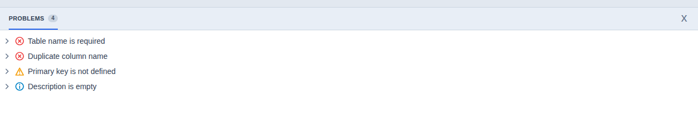

# Problems Panel

The Problems Panel shows diagnostics that help users understand whether an ER
diagram is valid for generation and deployment, and whether the model contains
items that deserve attention.

## Severity Levels

Use the following severity levels for Problems Panel items.

- `error`: makes the ER diagram invalid for DDL generation or database
  deployment.
- `warning`: does not invalidate the diagram, but may lead to issues in
  deployment or design.
- `info`: provides additional, non-critical hints or suggestions for improving
  table data. Info-level items are optional and must not indicate problems that
  require immediate action. If an item involves any risk, categorize it as a
  `warning` instead.

## Examples

Examples of `error` items:

- A required table physical name is missing, so DDL cannot name the table.
- Duplicate physical column names exist in the same table, so generated DDL
  would be invalid.
- A relationship references a table that does not exist, so the foreign key
  cannot be generated.

Examples of `warning` items:

- A table does not define a primary key, even though DDL can still be generated.
- A foreign key column is nullable where the relationship appears to be
  required.
- A table has no indexes other than its primary key, which may affect query
  performance after deployment.

Examples of `info` items:

- A table description is empty, but this does not affect DDL generation or
  deployment.
- A column description is empty, and adding one would make the model easier to
  review.
- A table or column name could be made more readable without changing the
  generated database structure.
